# Docker-Fundamentals
#### URLs
  - PR: 
    - [PR]()
  - Docker Hum images links:
    - [Stamp](https://hub.docker.com/r/devopskevlar/stamp) 
    - [Envprobe](https://hub.docker.com/r/devopskevlar/envprobe)
    - [Miniweb](https://hub.docker.com/r/devopskevlar/miniweb)
  - Repository URL
    - [Docker-Repo](https://github.com/kevlar2/docker-fundamentals)

## Overview 
In this project, I created three distinct images using a streamlined Dockerfile and pushed them to Docker Hub. My objective is to demonstrate my proficiency with Docker and to explore various networking modes: the default bridge, user-defined bridge, and host.

## Deliverables
-  Build & push three tiny images
   - stamp
   - envprobe
   - miniweb
-  Networking deep-dive exploring the below docker network types
   - Default bridge network
   - user-defined bridge network
   - Host network
- Container management

## Acceptance

- ✅ Repository: public Repo.
- ✅ Images: three public images exist on Docker Hub with the exact tags:
  - <DOCKERHUB_USERNAME>/stamp:v1
  - <DOCKERHUB_USERNAME>/envprobe:v1
  - <DOCKERHUB_USERNAME>/miniweb:v1
- ✅ stamp: prints one UTC timestamp and exits; evidence screenshot + brief description of Dockerfile instructions.
- ✅ envprobe: runs as non-root in your chosen working directory, prints one status line, remains alive for inspection; exec screenshots and file note included.
- ✅ miniweb: serves your professional page on container port 8080; browser (or terminal) screenshot included with header + your name.
- ✅ Networking: default bridge vs user-defined vs host network observations are correct and concise, each with screenshots and brief explanations.
- ✅ Introspection: screenshots show images, containers, and key image configuration fields; short paragraph on image/container and tag/digest distinctions.

--------------------------------------------------------------------------------------------------------------- 
### Build & push three images

#### Stamp - prints a UTC timestamp once, then exits
- Purpose is to set working directory and define default action. 
  ##### Docker hub | Local run showing UTC timestamp
  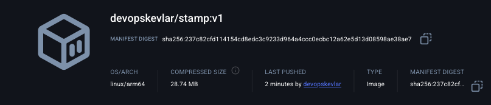

  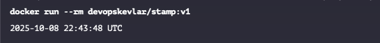

   - To successfully build this image, I used the following instructions:

     - FROM: Sets the base image.
     - WORKDIR: Sets the working or project directory.
     - CMD: Used to execute the command within the container.

#### Envprobe - Prints who/where it’s running, then stays alive for interactive inspection
- The purpose is to create a non-root user, set up a working directory, configure the environment, define entry points, and enable interactive inspection.
  ##### Docker hub | Container log line | Interactive container inspection
  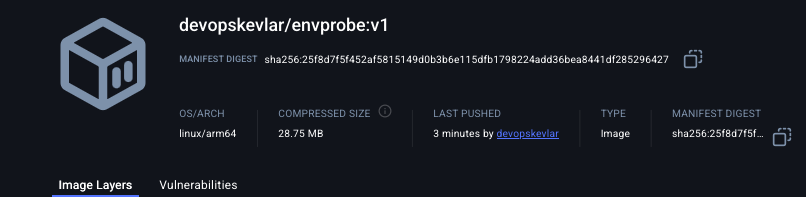

  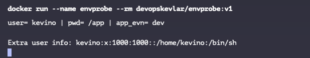

  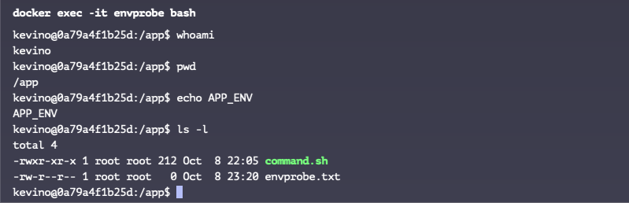

  - In the last screenshot, we created an envprobe.txt file inside the container. If you remove the container or start a new one from the same image, the file won't be there because it was created at runtime, not included in the image. 

#### Miniweb - Serves a professional static page on port 8080 Nginx
- The purpose is to copy content into an image, documenting ports, starting a service, and verifying health at a glance.
  ##### Docker hub | Rendered page
  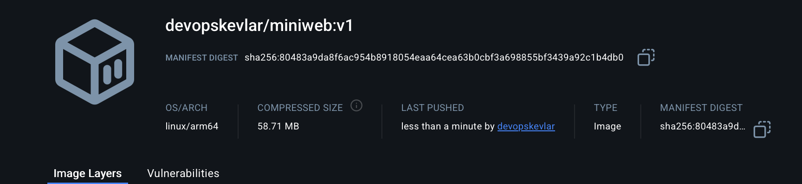

  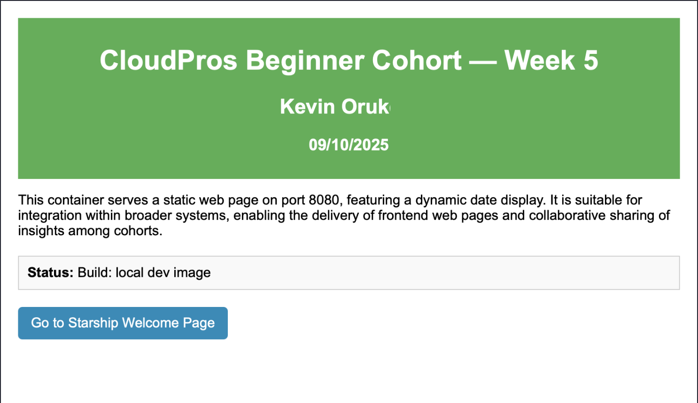

  - I confirmed the page was being served from container port 8080 by accessing the application via the browser using [localhost:8080](http://localhost:8080), and curl -i [localhost:8080](http://localhost:8080) to see the html content.

### Networking deep-dive (default bridge, user-defined bridge, host)

- The purpose is to use the images below to demonstrate different types of Docker networks and their use cases during development.
  - Server: miniweb (Web page)
  - client: envprobe (Connectivity test)

#### Default bridge (no custom network)
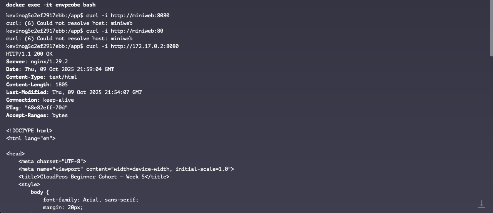

  - While the default bridge network creates an isolation to allow container to communicate with each other. The containers can only communicate with each other using the container's IP address. The container does not resolve name to IP address in the default bridge network.

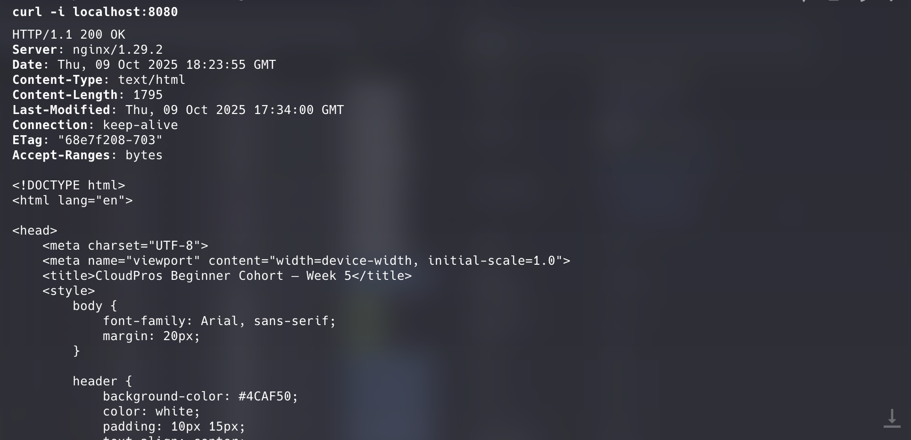

  - Mapping a host port to a container port with -p (port mapping or port publishing) flag, allows the host machine to access the web pages being served from the container even if the container is on the default bridge network.. 

#### User-defined bridge (recommended for multi-container work)

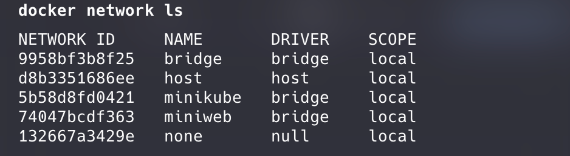

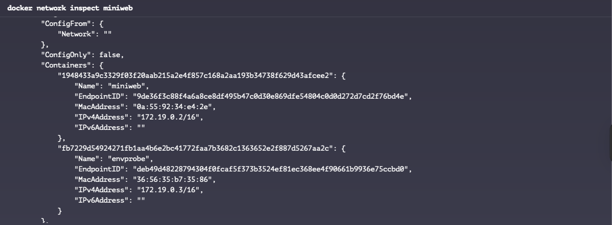

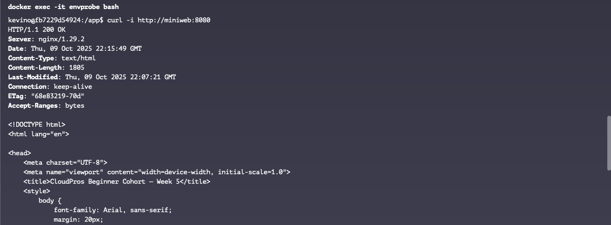

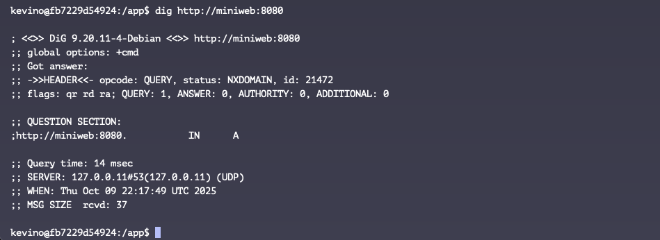

  - Here the container resolves container name to IP address in the User-defined bridge network using docker embedded DNS service.

##### Using network alias --network-alias webserver, starlinkserver

    docker run -d --name miniweb --network-alias webserver --network-alias starlinkserver --network miniweb -p 8080:8080 devopskevlar/miniweb:v1

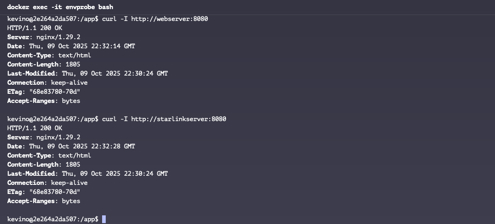

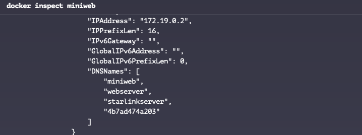

  - Docker aliases works be adding multiple DNS name that resolves to the same container ip address with a user defined network. Allow the same service to ve reached vai different names.

#### Host network (observation)

  ##### Problem:
  - On macOS with Docker Desktop, host networking doesn't work the same as on Linux, Docker Desktop runs in a Linux VM, so --network host only exposes ports within that VM, not to your macOS host.
  - While developing on macOS, it's best to avoid using the host network because it makes accessing your container more difficult.

  #### Solution
  - Replaced host networking with explicit port mapping: -p 80:80 or -p 8080:8080
  - This properly maps the container ports to your macOS host ports.

        docker run -d --name miniweb -p 80:80 -p 8080:8080 devopskevlar/miniweb:v1

### Introspection, basic lifecycle, and hygiene

- This aims to reveal the underlying process: managing containers in an organized manner and deploying them with professional standards.

#### Introspection snapshots
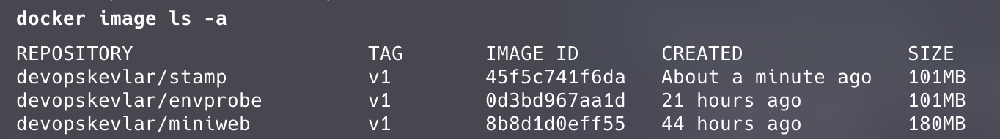

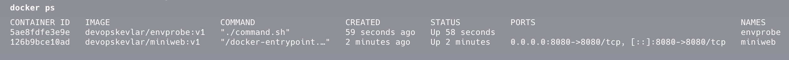

  - Below screenshots show configured workingdir, User, env variables and exposed ports.

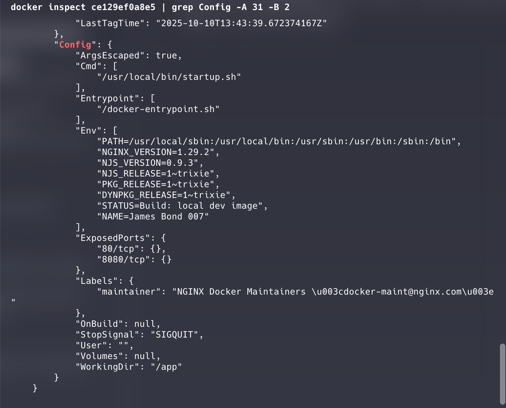

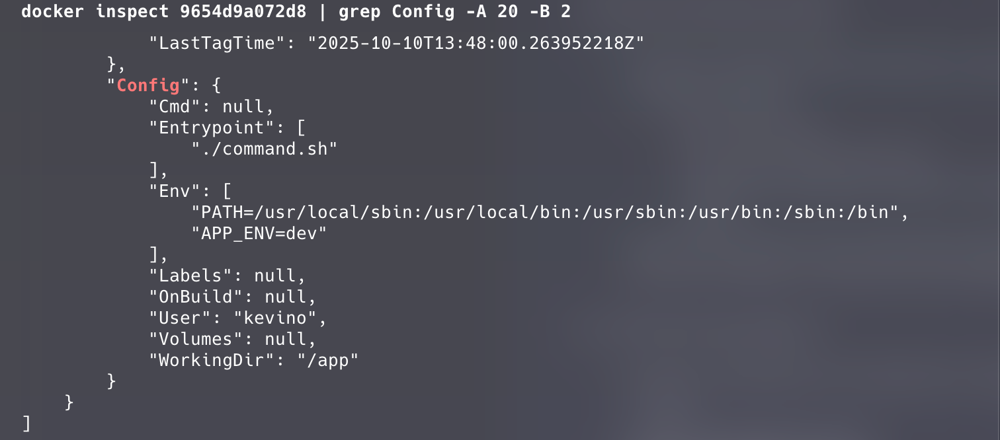

  - An image is a snapshot of your application, that contains, the code, files, folder and dependencies required to ship or run an application consistently. While the container is the runtime of an image.

  - A tag is mainly used to to differentiate version of the same image, it also helps with identifying builds while digest is a unique identifier for a specific version of an image, represented as a SHA256 hash. It ensures the integrity and authenticity of the image.

  - A safe way is to stop and remove a containers after use, is to use the following docker commands
      
    - docker run --rm <image-name> - The rm flag removes containers when they stop or finish.
    - docker stop - Stops the container.
    - docker rm - removes the container.

#### Exec (inside envprobe)
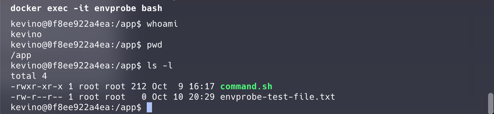

-Removing the container or creating a new one from the same image will not preserve envprobe-test-file.txt, as it's created at runtime and not part of the image.